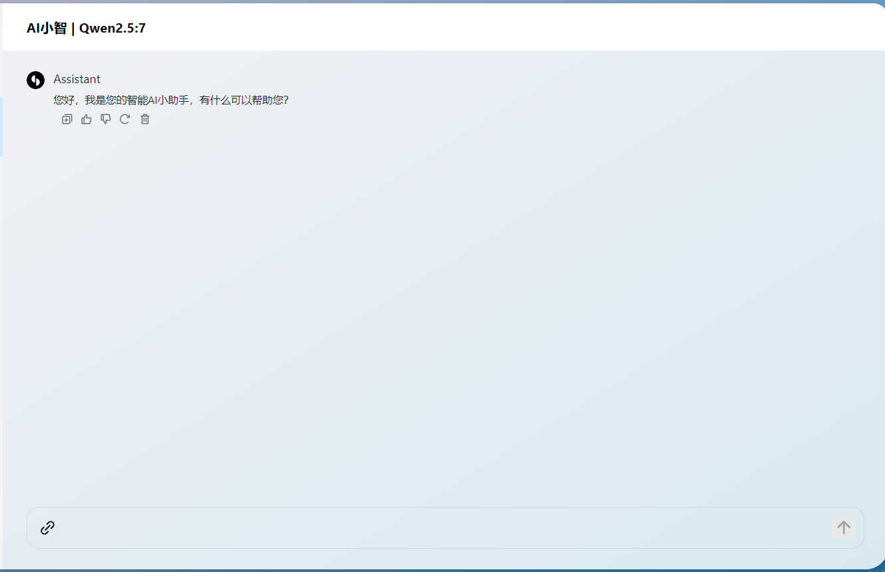
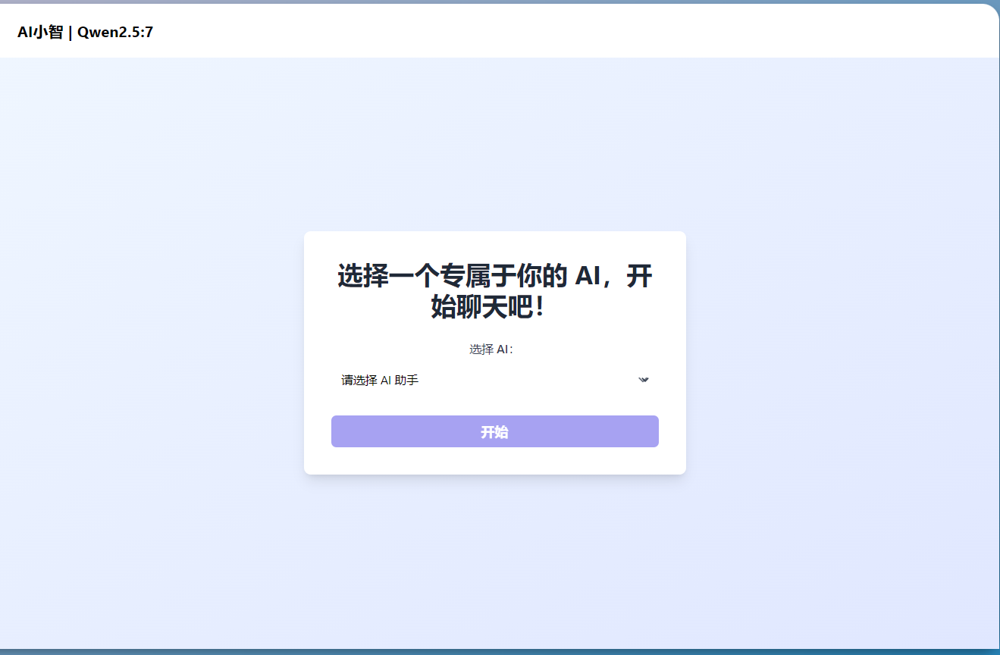
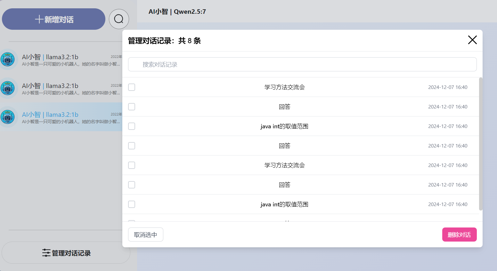
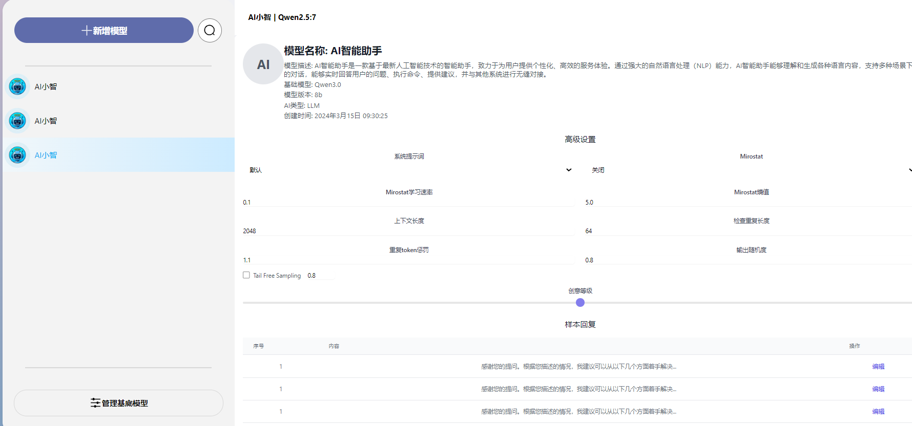

# 前端开发日志
#### 创建者：侯宇航
#### 创建时间: 2025年1月10日

## 日志号:20250110
#### 今天完成的任务
- 熟悉项目结构
- 左侧导航栏样式完善
- 《对话》页面的UI布局
- 滚动条样式美化
- 实现按钮动画
####  遇到的问题
- 暂无，一切正常
#### 接下来的计划
- 完成页面间跳转
- 完成后续页面开发
#### 已完成截图

## 日志号:20250111
#### 今天完成的任务
- 部分页面间跳转
- 新增对话页面
- AI首条默认回复
- 管理对话页面
- 模型管理页面（部分）
- 引入了pinia
- 引入了tailwindcss
####  遇到的问题
- 暂无，一切正常
#### 接下来的计划
- 完成后续页面开发
#### 已完成截图

